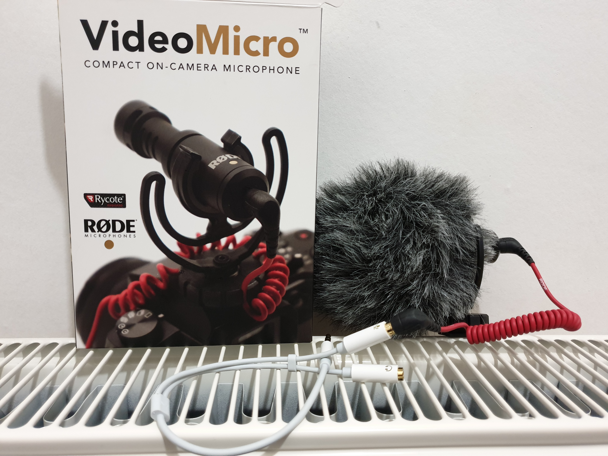

# screencast
The little guide to screencasting - This repository is dedicated to the art of the [screencast](https://en.wikipedia.org/wiki/Screencast).

Please feel free to
raise PR's to add to the [EXAMPLES.md](EXAMPLES.md)

## Introduction

Let's not beat around the bush - screencasting is an art form and as such people have their own styles. This guide is very much how I have found the best way to do it over the years. The sections below descibe some principles I have found useful to stick to and the reasons for doing so. Enjoy the read!

## Clear Intent

Before starting you probably already have a clear reason for doing the screencast. I have always found it useful to write the aims out like a "Table of Contents" at the start of a book. But at the same time, don't over prepare because that can result in a very staid, slow and heavy feel to the result. That said, whatever topic you wish to cover the knowledge you want to transfer as part of the screencast should be clear in your mind.

## The 3-D Approach

When mentoring developers I will often refer to the 3-dimensional developer, that is  skilled in the following areas:
- Domain skills - Understanding the client and industry sector
- Hard skills - Technical
- Soft skills - Communication

These areas are good to consider when thinking about how you pitch your screencast.

In relation to "Domain skills" ask youself what you need to ensure you cover if your screencast is being pitched at a particular industry sector. For example, if its social media then you want to convey a good understanding and how the presentation can help people in this sector.

Hard skills is probably the easiest to get right, as developers we pride ourselves on our technical skills. The key question to ask is: Do you have the technical explanations pitched at the right level? If you want to talk to different technical audiences then perhaps you need to make different screencasts targeted specifically for them.

Finally the softer skills is probably where we need the most attention so let's start another section for that...

## Communication

When it comes to the soft skills, these should be targetted for your audience. My preference is for a conversational style (more on that in the next section) but if your audience is more academic then perhaps a more formal style is suitable. What you are trying to do here is make your presentation the best flavour for the type of people who will view it.

Remember you are communicating with two mediums - what is on the screen and the narrative that you are adding. One of the biggest mistakes is going to fast, or flicking backwards and forwards because you have missed something - the voice over maybe perfect but the video can become distracting. Now to your voice, most people do not like the sound of their own voice... but guess what? All your friends and family are used to it already, so its probably time you got used to it too :) The biggest mistake here is to talk in a monochrome way rather then with intonation in your voice. The best way to solve this is in the next section.

## Focused and Relaxed

Utilmate I like the feel of a screencast to be like someone is having an engaging conversation with me. When screencasting imagine you are talking to a collegue in the Pub - do it with a beer if it helps. Another tip is to record with a friend/collegue if you find recording alone a bit daunting. After all the more relaxed the setting the more the view will engage and retain too.

Another thing is not to worry about the "ums" and the "ers" - people are not expecting you to become the next new presenter. In the end if you do make a mistake you can always edit it out in the post-processing phase. But post processing can be a time hungry excercise and so I would tend to leave in all but the most catasrophic of mistakes.

I do screencasting like I do my software - that is in the [Lean](https://en.wikipedia.org/wiki/Lean_manufacturing) way. If what you have recorded would bring added value to people then publish it, the chances are that if you are doing a screencast on software then its probably going to be out of date in 6 months anyway. Release fast and release often... you can always improve it later, don't spend time perfecting it.

## Hardware and Software

Finally a guide would not be complete without talking about the hardware and software that I use.

### Hardware
- **A Dell XPS laptop running Ubuntu 18.04 LTS**
- **Cell phone holder on a gooseneck clamp** - I use this to hold the microphone so it makes it easy to position it close to your mouth without being in the way of your screen.
- [**"VideoMicro" by RØDE**](https://www.rode.com/microphones/videomicro) - This microphone can be mounted on a camera so it comes on a shoe with a shock mount. It uses a standard 3.5mm jack and does not need powering. I find the quality of this mic amazing and versatile to use in all sort of situations (like taking videos of my Granchild with my DSLR)
- **3.5mm headphone/mic Y splitter** - I just find this useful in case I want to wear headphones too.

### Software

- [**Kazam**](https://launchpad.net/kazam) - For recording the screencast.
- [**Kdenlive**](https://kdenlive.org/en/) - For transcoding the video/audio to its final format.
- [**Audacity**](https://www.audacityteam.org/) - Very rarely for adjusting any audio track - or completely re-doing the audio - for the more advanced.
- [**AWS S3**](https://aws.amazon.com/s3/) - For hosting the video, unless you want to sell your soul to YouTube.

## Before you start

Make sure you do a test for a few seconds before you start, and check:

- [ ] The audio input is the correct device.
- [ ] The audio input is at the corret level - its not too high so that it clips.
- [ ] The video is (not) capturing the mouse.
- [ ] The video is (not) highlighting mouse clicks.
- [ ] The video resolution is sufficient and/or the text size is good.

**Have Fun!** Don't forget to send me some of your examples... **Thanks!**